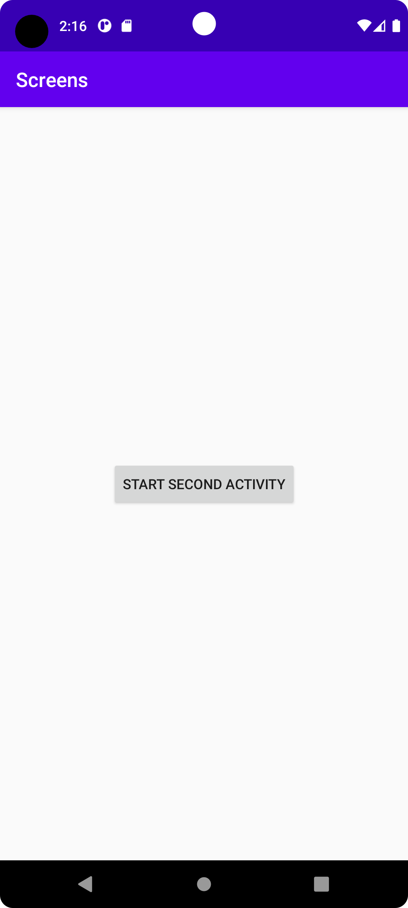
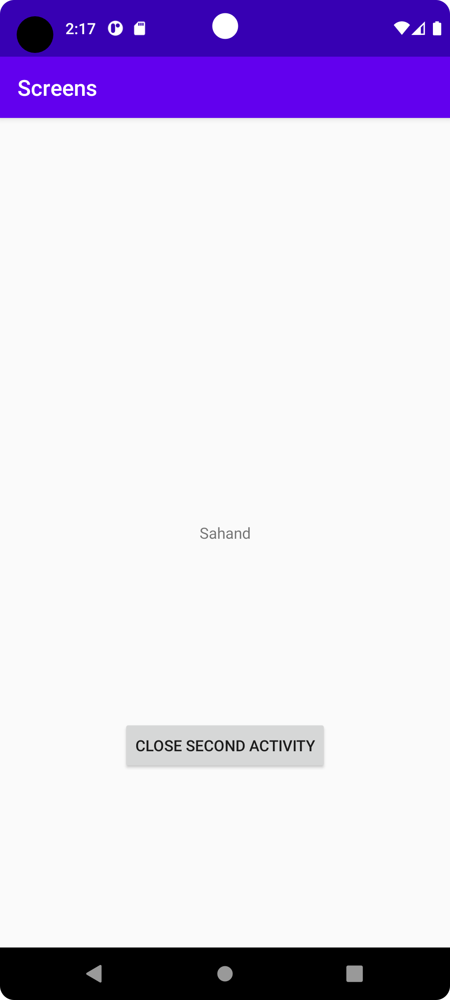

# Rapport

**Det första som gjordes var att forka appen screens till repository i Android Studio. 
Det 1 problemet löstes genom att skapa en ny activity mha en tutorial. På så sätt skapades en 
ny MainActivity fil tillsammans med en ny activity_main fil.
Det 2 problemet löstes genom att skapa en setOnClickListener i MainActivity filen för att få knappen
att göra någonting, i det här fallet byta till den andra activity, finns i snipkoden. Det som också 
gjordes var att skapa en button view i activity_main filen genom att skriva lite kod, finns i snipkoden. 
Det skapades även en button view i den andra activity genom att ändra i activity_main2 filen.
Det 3 problemet löstes genom att lägga till en rad kod i MainActivity filen och ansvarar för datan 
som visas i activity_main2 filen, finns i snipkoden. I den andra activity i MainActivity2 skrevs lite
kod som har funktionen att skapa en textview samt en bundle för att hantera datan som visas i textviewn.
När användaren är i den andra activity ska de kunna gå ut och för det skapades en funktion i MainActivity2 filen
som hanterar det, finns i snipkoden. I activity_main2 filen skapades en textview för att visa datan från intent,
finns i snipkoden. Det lades en rad av kod för att flytta upp knappen i den andra activity i activity_main2 filen
i button view längst ner, och finns i snipkoden.**

```
setContentView(R.layout.activity_main);
        Button button = findViewById(R.id.startSecondActivity);
        button.setOnClickListener(new View.OnClickListener() {
            @Override
            public void onClick(View view) {
                Intent intent = new Intent(MainActivity.this, MainActivity2.class);
                startActivity(intent);
            }
        });
        
<Button
        android:id="@+id/startSecondActivity"
        android:layout_width="wrap_content"
        android:layout_height="wrap_content"
        android:text="Start second activity"
        app:layout_constraintBottom_toBottomOf="parent"
        app:layout_constraintLeft_toLeftOf="parent"
        app:layout_constraintRight_toRightOf="parent"
        app:layout_constraintTop_toTopOf="parent" />
        
intent.putExtra("name", "Sahand");

TextView textView = findViewById(R.id.myTextView);

        Bundle extras = getIntent().getExtras();
        if(extras != null){
            String name = extras.getString("name");
            textView.setText(name);
        }

        Button close = findViewById(R.id.closeSecondActivity);
        close.setOnClickListener(new View.OnClickListener() {
            @Override
            public void onClick(View view) {
                finish();
            }
        });
        
<TextView
        android:id="@+id/myTextView"
        android:layout_width="wrap_content"
        android:layout_height="wrap_content"
        app:layout_constraintBottom_toBottomOf="parent"
        app:layout_constraintLeft_toLeftOf="parent"
        app:layout_constraintRight_toRightOf="parent"
        app:layout_constraintTop_toTopOf="parent"/>
        
app:layout_constraintTop_toBottomOf="@+id/myTextView"
```

Bilder läggs i samma mapp som markdown-filen.




Läs gärna:

- Boulos, M.N.K., Warren, J., Gong, J. & Yue, P. (2010) Web GIS in practice VIII: HTML5 and the canvas element for interactive online mapping. International journal of health geographics 9, 14. Shin, Y. &
- Wunsche, B.C. (2013) A smartphone-based golf simulation exercise game for supporting arthritis patients. 2013 28th International Conference of Image and Vision Computing New Zealand (IVCNZ), IEEE, pp. 459–464.
- Wohlin, C., Runeson, P., Höst, M., Ohlsson, M.C., Regnell, B., Wesslén, A. (2012) Experimentation in Software Engineering, Berlin, Heidelberg: Springer Berlin Heidelberg.
